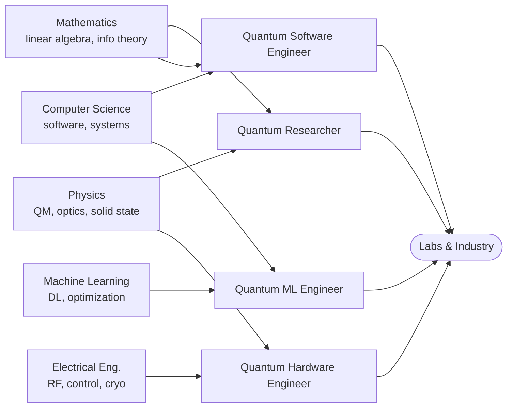

The quantum computing job market is small but growing fast, and it is unusual in one important way: there is no single "quantum job." A handful of hardware companies, cloud providers, national labs, startups, and consultancies all hire under the quantum banner, but they want very different people. Some roles look almost identical to mainstream software engineering with a quantum SDK bolted on; others demand a PhD in condensed-matter physics and time in a cryogenics lab.

This page helps you find your entry point. Be realistic: the field is early, headcounts are modest, and a lot of demand is concentrated in research labs and a few well-funded companies. But the flip side is that the barrier to *contributing* is lower than the hype suggests — open-source frameworks, free cloud access to real hardware, and an open research literature mean you can build a credible portfolio without insider access.

## Where you might come from

Most people enter quantum from one of four backgrounds. None is a hard requirement, but each maps more naturally onto certain roles.

The arrows show the *easiest* transitions, not the only ones. A strong mathematician can move into any role; a software engineer who picks up enough physics can do research engineering. Lateral moves are common once you are inside the field.

## The four roles at a glance

| Role | Focus | Typical background | Key tools |
| --- | --- | --- | --- |
| [Quantum Software Engineer](./software-engineer.md) | Building SDKs, compilers, simulators, and applications on top of quantum hardware | CS, software engineering, math | Qiskit, Cirq, Python, C++, Rust |
| [Quantum Researcher](./researcher.md) | Inventing algorithms, proving bounds, advancing theory and error correction | Physics, math, theoretical CS | LaTeX, NumPy, proof skills, arXiv |
| [Quantum ML Engineer](./qml-engineer.md) | Hybrid quantum-classical models, variational circuits, data encoding | ML, CS, applied math | PennyLane, TensorFlow Quantum, PyTorch |
| [Quantum Hardware Engineer](./hardware-engineer.md) | Designing, calibrating, and controlling physical qubit devices | Physics, electrical engineering | Cryogenics, RF/microwave, FPGAs, control stacks |

## How to choose

- **Like writing code and shipping tools?** Start with [Quantum Software Engineer](./software-engineer.md). It is the most accessible entry point if you already program.
- **Drawn to theory, proofs, and open problems?** Look at [Quantum Researcher](./researcher.md), and expect graduate study to be on the path.
- **Coming from machine learning?** [Quantum ML Engineer](./qml-engineer.md) lets you reuse most of your skills while learning a new substrate — just keep a critical eye on the (still uncertain) practical advantages.
- **Want to work with the physical devices?** [Quantum Hardware Engineer](./hardware-engineer.md) is lab-heavy and the closest to experimental physics and electrical engineering.

## Build the foundation first

Whatever role you target, the groundwork is shared: linear algebra, the circuit model, and a working framework. Move through the [Learning Roadmaps](../roadmaps/overview.md), get your hands dirty in the [Hands-on Labs](../labs/overview.md), and pick a stack from the [Frameworks](../frameworks/overview.md) guide. A portfolio of real, runnable projects will do more for you than any single credential — the role pages below give concrete project ideas for each track.
