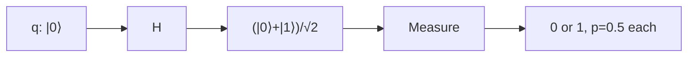

## Overview

Classical computers cannot generate true randomness. Functions like Python's `random.random()` are **pseudo-random**: they run a deterministic algorithm seeded by some value, so given the seed you can reproduce the entire sequence. That is fine for games but unacceptable for cryptographic keys.

Quantum mechanics gives us randomness that is, as far as physics knows, **fundamental and irreducible**. In this lab you put each qubit into an equal superposition with a Hadamard gate and measure it. Each measurement yields `0` or `1` with exactly 50% probability, and no algorithm, seed, or amount of computation can predict the outcome. You will turn a register of such bits into a uniformly distributed integer.

## Theory

A single qubit starts in the state $\lvert 0 \rangle$. The Hadamard gate $H$ is defined by

$$
H = \frac{1}{\sqrt{2}} \begin{pmatrix} 1 & 1 \\ 1 & -1 \end{pmatrix}.
$$

Applying it to $\lvert 0 \rangle$ produces the equal superposition

$$
H \lvert 0 \rangle = \frac{1}{\sqrt{2}}\left(\lvert 0 \rangle + \lvert 1 \rangle\right).
$$

The probability of measuring outcome $x \in \{0,1\}$ is given by the Born rule, the modulus-squared of the amplitude:

$$
P(0) = \left| \frac{1}{\sqrt{2}} \right|^2 = \frac{1}{2}, \qquad
P(1) = \left| \frac{1}{\sqrt{2}} \right|^2 = \frac{1}{2}.
$$

Measurement collapses the superposition to whichever outcome occurred. The randomness is not "hidden information we lack" — under standard quantum mechanics there is no underlying variable that determined the result in advance.

For $n$ independent qubits each in superposition, the $n$-bit outcome is uniformly distributed over all $2^n$ values, because the probabilities multiply:

$$
P(b_{n-1}\dots b_0) = \prod_{i=0}^{n-1} \frac{1}{2} = \frac{1}{2^n}.
$$



## Implementation

We build an $n$-qubit circuit, apply a Hadamard to every qubit, measure all of them, run a single shot, and interpret the resulting bitstring as an integer.

```python
from qiskit import QuantumCircuit, transpile
from qiskit_aer import AerSimulator

def quantum_random_int(n_bits: int, shots: int = 1) -> list[int]:
    """Generate `shots` uniformly random integers in [0, 2**n_bits - 1]."""
    qc = QuantumCircuit(n_bits, n_bits)

    # Put every qubit into an equal superposition.
    for q in range(n_bits):
        qc.h(q)

    # Measure each qubit into its matching classical bit.
    qc.measure(range(n_bits), range(n_bits))

    sim = AerSimulator()
    compiled = transpile(qc, sim)
    # memory=True lets us read each individual shot, not just aggregate counts.
    result = sim.run(compiled, shots=shots, memory=True).result()
    bitstrings = result.get_memory()

    # Qiskit returns bitstrings with qubit 0 as the rightmost character,
    # which int(..., 2) interprets correctly as a binary number.
    return [int(bits, 2) for bits in bitstrings]

if __name__ == "__main__":
    # One 8-bit random number (0..255).
    print("Single 8-bit value:", quantum_random_int(8)[0])

    # Verify the distribution is uniform by sampling many 3-bit values.
    samples = quantum_random_int(3, shots=8000)
    from collections import Counter
    hist = Counter(samples)
    print("3-bit distribution over 8000 shots:")
    for value in range(8):
        print(f"  {value}: {hist.get(value, 0)}")
```

What each piece does:

- `QuantumCircuit(n_bits, n_bits)` allocates `n_bits` qubits and `n_bits` classical bits to hold the measurement results.
- The loop applies `H` to each qubit, creating an $n$-qubit uniform superposition.
- `qc.measure(...)` collapses every qubit and records the bit.
- `memory=True` is essential here: it returns the individual outcome of each shot so we can produce many independent random numbers, rather than only a frequency histogram.
- `int(bits, 2)` converts the binary string to a decimal integer.

## Run it

A single run prints something different every time — that is the point. A typical session:

```text
Single 8-bit value: 173
3-bit distribution over 8000 shots:
  0: 1002
  1: 988
  2: 1011
  3: 994
  4: 1023
  5: 977
  6: 1005
  7: 1000
```

Each of the 8 outcomes should land near `8000 / 8 = 1000`, confirming a uniform distribution. The exact value of "Single 8-bit value" will be unpredictable on every execution.

## Exercises

1. **(Beginner)** Modify `quantum_random_int` to return a random **float** in $[0, 1)$ by generating a 16-bit integer and dividing by $2^{16}$. Verify the mean over many samples is close to $0.5$.
2. **(Beginner)** Build a quantum coin flip that prints `"Heads"` or `"Tails"`. Run it 1000 times and report the ratio.
3. **(Intermediate)** A fair die has 6 faces, but 3 qubits give 8 outcomes. Implement **rejection sampling**: generate 3-bit values, reject `6` and `7`, and retry. Confirm the six surviving outcomes are uniform.
4. **(Intermediate)** Replace the Hadamard with an $R_y(\theta)$ rotation. Derive the value of $\theta$ that biases the qubit so $P(1) = 0.25$, implement it, and verify empirically. *(Hint: $P(1) = \sin^2(\theta/2)$.)*
5. **(Advanced)** Use Qiskit's `Statevector` class to print the amplitudes of the 3-qubit superposition **before** measurement, and confirm every amplitude equals $1/\sqrt{8}$.

## Further reading

- Qiskit textbook: [Single-qubit gates and the Hadamard](https://qiskit.org/learn/)
- Nielsen & Chuang, *Quantum Computation and Quantum Information*, Section 1.3 (the Born rule).
- The [intermediate roadmap](../roadmaps/intermediate.md) for where to go next.
- Next lab: [Quantum Teleportation](./02-teleportation.md).
