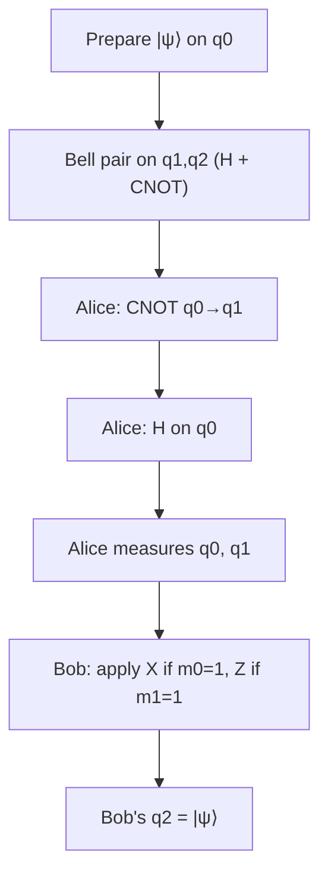

## Overview

Quantum teleportation moves the **state** of a qubit from one place (Alice) to another (Bob) without physically sending the qubit and without ever learning what the state is. It does not violate the no-cloning theorem — Alice's original qubit is destroyed in the process — and it does not transmit information faster than light, because Bob's qubit is useless until he receives two classical bits from Alice.

This is a cornerstone protocol: it underlies quantum repeaters, distributed quantum computing, and many error-correction schemes. In this lab you prepare an arbitrary state, teleport it, and confirm Bob ends up holding exactly what Alice started with.

## Theory

Alice wants to send the unknown state

$$
\lvert \psi \rangle = \alpha \lvert 0 \rangle + \beta \lvert 1 \rangle .
$$

Alice and Bob first share an entangled **Bell pair**, created by a Hadamard followed by a CNOT:

$$
\lvert \Phi^+ \rangle = \frac{1}{\sqrt{2}}\left( \lvert 00 \rangle + \lvert 11 \rangle \right).
$$

The full three-qubit system is $\lvert \psi \rangle \otimes \lvert \Phi^+ \rangle$. Alice applies a CNOT from her message qubit onto her half of the Bell pair, then a Hadamard on the message qubit, then measures both of her qubits. Expanding the algebra, the global state can be rewritten as

$$
\frac{1}{2}\Big[
\lvert 00 \rangle (\alpha\lvert 0\rangle + \beta\lvert 1\rangle)
+ \lvert 01 \rangle (\alpha\lvert 1\rangle + \beta\lvert 0\rangle)
+ \lvert 10 \rangle (\alpha\lvert 0\rangle - \beta\lvert 1\rangle)
+ \lvert 11 \rangle (\alpha\lvert 1\rangle - \beta\lvert 0\rangle)
\Big].
$$

The two classical bits $(m_1, m_0)$ Alice measures tell Bob which of the four cases occurred. Bob then applies a correction:

| Alice's bits $(m_1 m_0)$ | Bob's qubit | Correction |
|---|---|---|
| `00` | $\alpha\lvert 0\rangle + \beta\lvert 1\rangle$ | $I$ (nothing) |
| `01` | $\alpha\lvert 1\rangle + \beta\lvert 0\rangle$ | $X$ |
| `10` | $\alpha\lvert 0\rangle - \beta\lvert 1\rangle$ | $Z$ |
| `11` | $\alpha\lvert 1\rangle - \beta\lvert 0\rangle$ | $ZX$ |

After the correction Bob's qubit is exactly $\lvert \psi \rangle$.



## Implementation

We use three qubits: `q0` is Alice's message, `q1` is Alice's half of the Bell pair, `q2` is Bob's half. We teleport a specific test state and then **invert** its preparation on Bob's qubit; if teleportation worked, Bob's qubit returns to $\lvert 0 \rangle$ and we should measure `0` every time.

```python
import numpy as np
from qiskit import QuantumCircuit, QuantumRegister, ClassicalRegister, transpile
from qiskit_aer import AerSimulator

def build_teleportation(theta: float, phi: float) -> QuantumCircuit:
    """Teleport Ry(theta)Rz(phi)|0> from q0 to q2, then verify."""
    q = QuantumRegister(3, "q")      # q0 message, q1 Alice's pair, q2 Bob's pair
    c = ClassicalRegister(3, "c")    # c0,c1 Alice's measurements; c2 final check
    qc = QuantumCircuit(q, c)

    # 1. Prepare an arbitrary state |psi> on Alice's qubit q0.
    qc.ry(theta, q[0])
    qc.rz(phi, q[0])
    qc.barrier()

    # 2. Create the Bell pair across q1 (Alice) and q2 (Bob).
    qc.h(q[1])
    qc.cx(q[1], q[2])
    qc.barrier()

    # 3. Alice entangles her message with her half, then rotates to the X basis.
    qc.cx(q[0], q[1])
    qc.h(q[0])
    qc.barrier()

    # 4. Alice measures her two qubits.
    qc.measure(q[0], c[0])  # m0 -> controls X correction
    qc.measure(q[1], c[1])  # m1 -> controls Z correction

    # 5. Bob applies classically-conditioned corrections.
    with qc.if_test((c[1], 1)):
        qc.z(q[2])
    with qc.if_test((c[0], 1)):
        qc.x(q[2])
    qc.barrier()

    # 6. Verification: undo the original preparation on Bob's qubit.
    #    If teleportation is perfect, q2 returns to |0>.
    qc.rz(-phi, q[2])
    qc.ry(-theta, q[2])
    qc.measure(q[2], c[2])
    return qc

if __name__ == "__main__":
    theta, phi = 1.2345, 0.7  # an arbitrary, generic state
    qc = build_teleportation(theta, phi)

    sim = AerSimulator()
    result = sim.run(transpile(qc, sim), shots=4096).result()
    counts = result.get_counts()

    # Aggregate over Alice's (random) bits, looking only at c2 (leftmost char).
    bob = {"0": 0, "1": 0}
    for bitstring, n in counts.items():
        bob[bitstring[0]] += n
    print("Bob's verification qubit:", bob)
    success = bob["0"] / sum(bob.values())
    print(f"Teleportation fidelity (ideal=1.0): {success:.4f}")
```

Key points:

- `with qc.if_test((c[i], 1)):` is the modern Qiskit way to apply a gate **conditioned on a classical measurement result** — exactly the classical channel from Alice to Bob.
- The `barrier()` calls are visual separators that prevent the transpiler from merging the protocol stages; they do not change the result.
- The verification trick (steps 6) is the cleanest way to check teleportation without statevector access: we apply the inverse of the preparation and expect `0`.

## Run it

Because Alice's measured bits are genuinely random, the leftmost character of each bitstring (Bob's check) should still be `0` in every shot:

```text
Bob's verification qubit: {'0': 4096, '1': 0}
Teleportation fidelity (ideal=1.0): 1.0000
```

A fidelity of `1.0000` on the noiseless simulator confirms the state arrived intact. On real hardware you would see a value slightly below 1 due to gate and measurement noise.

## Exercises

1. **(Beginner)** Print the full `counts` dictionary and confirm that Alice's two bits (`c0`, `c1`) appear with roughly equal 25% frequency across the four combinations.
2. **(Beginner)** Teleport the basis state $\lvert 1 \rangle$ (set `theta = np.pi`, `phi = 0`) and remove the verification step. What does Bob's qubit measure as, and why?
3. **(Intermediate)** Use `qiskit.quantum_info.Statevector` to confirm the Bell pair $\lvert \Phi^+ \rangle$ is created correctly before any teleportation steps.
4. **(Intermediate)** Replace the two `if_test` corrections with the deferred-measurement trick: use `cz` and `cx` gates controlled on the qubits directly (no measurement) and explain why the result is equivalent.
5. **(Advanced)** Add a depolarizing noise model to the `AerSimulator` and plot the teleportation fidelity as a function of the error rate.

## Further reading

- Bennett et al., *Teleporting an Unknown Quantum State via Dual Classical and EPR Channels*, Phys. Rev. Lett. 70, 1895 (1993) — the original paper.
- Qiskit textbook: [Quantum Teleportation](https://qiskit.org/learn/).
- Previous lab: [Quantum Random Number Generator](./01-quantum-rng.md). Next: [Grover Search](./03-grover.md).
