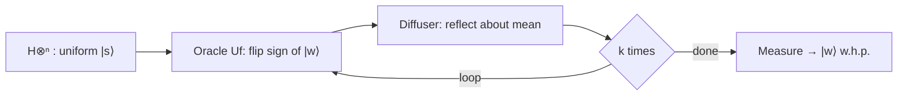

## Overview

Suppose you have an unsorted list of $N$ items and exactly one of them is "marked." Classically you must check items one by one, taking on average $N/2$ queries and $N$ in the worst case. **Grover's algorithm** finds the marked item in about $\frac{\pi}{4}\sqrt{N}$ queries — a quadratic speedup that is provably optimal for unstructured search.

The trick is *amplitude amplification*: we start in a uniform superposition over all candidates, then repeatedly rotate the state vector so that amplitude piles up on the marked item, making it overwhelmingly likely to appear when measured. In this lab you mark a target 3-bit state and watch it dominate the output.

## Theory

Work with $n$ qubits, so $N = 2^n$. Start from the uniform superposition

$$
\lvert s \rangle = H^{\otimes n} \lvert 0 \rangle^{\otimes n} = \frac{1}{\sqrt{N}} \sum_{x=0}^{N-1} \lvert x \rangle .
$$

Each Grover iteration applies two operators.

**The oracle** $U_f$ flips the sign of the marked state $\lvert w \rangle$ and leaves all others alone:

$$
U_f \lvert x \rangle = (-1)^{f(x)} \lvert x \rangle, \qquad f(x) = 1 \text{ iff } x = w .
$$

**The diffusion operator** (Grover diffuser) reflects every amplitude about the mean amplitude:

$$
D = 2\lvert s \rangle \langle s \rvert - I .
$$

Geometrically, the combined step is a rotation of the state vector by a fixed angle $\theta$ toward $\lvert w \rangle$, where $\sin(\theta/2) = 1/\sqrt{N}$. The optimal number of iterations is

$$
k \approx \frac{\pi}{4}\sqrt{N} .
$$

For $n = 3$ ($N = 8$) the optimum is $k = 2$ iterations. Running more than the optimal number actually *over-rotates* and lowers the success probability.



## Implementation

We mark the 3-qubit target state `101` (decimal 5). The oracle is built from a multi-controlled-Z surrounded by `X` gates that select exactly the target bit pattern.

```python
import numpy as np
from qiskit import QuantumCircuit, transpile
from qiskit_aer import AerSimulator

def phase_oracle(n: int, marked: str) -> QuantumCircuit:
    """Flip the phase of the basis state `marked` (a bitstring like '101')."""
    qc = QuantumCircuit(n, name="oracle")
    # X on qubits where the target bit is 0, so the all-ones state selects `marked`.
    zero_positions = [i for i, bit in enumerate(reversed(marked)) if bit == "0"]
    if zero_positions:
        qc.x(zero_positions)
    # Multi-controlled Z = H on target, multi-controlled X, H on target.
    qc.h(n - 1)
    qc.mcx(list(range(n - 1)), n - 1)
    qc.h(n - 1)
    if zero_positions:
        qc.x(zero_positions)
    return qc

def diffuser(n: int) -> QuantumCircuit:
    """Reflection about the uniform superposition |s>."""
    qc = QuantumCircuit(n, name="diffuser")
    qc.h(range(n))
    qc.x(range(n))
    qc.h(n - 1)
    qc.mcx(list(range(n - 1)), n - 1)
    qc.h(n - 1)
    qc.x(range(n))
    qc.h(range(n))
    return qc

def grover(n: int, marked: str) -> QuantumCircuit:
    qc = QuantumCircuit(n, n)
    qc.h(range(n))  # uniform superposition

    iterations = int(round(np.pi / 4 * np.sqrt(2 ** n)))
    oracle = phase_oracle(n, marked)
    diff = diffuser(n)
    for _ in range(iterations):
        qc.compose(oracle, inplace=True)
        qc.compose(diff, inplace=True)

    qc.measure(range(n), range(n))
    return qc, iterations

if __name__ == "__main__":
    n, target = 3, "101"
    qc, iters = grover(n, target)
    print(f"n={n}, target={target}, Grover iterations={iters}")

    sim = AerSimulator()
    counts = sim.run(transpile(qc, sim), shots=2048).result().get_counts()

    for state in sorted(counts):
        bar = "#" * (counts[state] * 40 // 2048)
        print(f"  {state}: {counts[state]:4d} {bar}")
    best = max(counts, key=counts.get)
    print(f"Most frequent outcome: {best} (target was {target})")
```

How it works:

- `phase_oracle` wraps a multi-controlled-Z (`H`–`mcx`–`H`) in `X` gates so that the all-ones controlled condition lands exactly on the chosen bitstring. This flips only the target's phase.
- `diffuser` implements $D = 2\lvert s\rangle\langle s\rvert - I$ via the standard `H`–`X`–(controlled-Z)–`X`–`H` sandwich.
- `grover` repeats oracle + diffuser the optimal number of times computed from $\frac{\pi}{4}\sqrt{N}$.

## Run it

After 2 iterations the marked state `101` should dominate, appearing with probability above 90%:

```text
n=3, target=101, Grover iterations=2
  000:   16 #
  001:   14 #
  010:   18 #
  011:   17 #
  100:   15 #
  101: 1925 #####################################
  110:   13 #
  111:   12 #
Most frequent outcome: 101 (target was 101)
```

Exact counts vary run to run, but `101` should win decisively. Compare this to a classical search, which would need up to 8 checks; Grover used 2 oracle queries.

## Exercises

1. **(Beginner)** Change `target` to `"011"` and confirm Grover now amplifies that state instead.
2. **(Beginner)** Run the circuit with `iterations` forced to `1`, then `3`. Explain why 3 iterations gives a *worse* success probability than 2.
3. **(Intermediate)** Extend the code to $n = 4$ ($N = 16$). What is the optimal iteration count, and what success probability do you measure?
4. **(Intermediate)** Modify `phase_oracle` to mark **two** target states. How does the optimal iteration count change, and does the algorithm split probability between them?
5. **(Advanced)** Plot the success probability as a function of the number of iterations from 0 to 6 (for $n=3$) and overlay the theoretical curve $\sin^2\!\big((2k+1)\theta/2\big)$ with $\sin(\theta/2) = 1/\sqrt{N}$.

## Further reading

- Grover, *A fast quantum mechanical algorithm for database search*, STOC 1996.
- Nielsen & Chuang, Section 6.1 (the quantum search algorithm).
- The [intermediate roadmap](../roadmaps/intermediate.md) for related algorithms.
- Previous: [Quantum Teleportation](./02-teleportation.md). Next: [Deutsch–Jozsa](./04-deutsch-jozsa.md).
