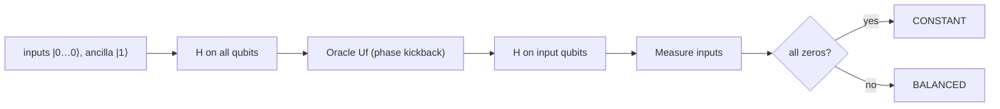

## Overview

The Deutsch–Jozsa algorithm is the classic demonstration that a quantum computer can be **exponentially** faster than any classical one for a specific (admittedly contrived) problem. You are given a black-box function $f:\{0,1\}^n \to \{0,1\}$ that is **promised** to be either:

- **constant** — it outputs the same value (all 0 or all 1) for every input, or
- **balanced** — it outputs 0 for exactly half of the inputs and 1 for the other half.

Classically, to be *certain* in the worst case you must query the function $2^{n-1}+1$ times. The Deutsch–Jozsa algorithm decides with **a single quantum query**, with certainty. This lab builds the oracle, runs the algorithm, and reads the verdict directly from the measurement.

## Theory

We use $n$ input qubits and one ancilla qubit. Initialize the ancilla in $\lvert 1 \rangle$ and apply Hadamards everywhere. The input register becomes the uniform superposition and the ancilla becomes $\lvert - \rangle = \frac{1}{\sqrt{2}}(\lvert 0 \rangle - \lvert 1 \rangle)$.

The oracle $U_f \lvert x \rangle \lvert y \rangle = \lvert x \rangle \lvert y \oplus f(x) \rangle$ produces **phase kickback** when the ancilla is in $\lvert - \rangle$:

$$
U_f \lvert x \rangle \lvert - \rangle = (-1)^{f(x)} \lvert x \rangle \lvert - \rangle .
$$

So the input register evolves to

$$
\frac{1}{\sqrt{2^n}} \sum_{x} (-1)^{f(x)} \lvert x \rangle .
$$

Apply Hadamards to the input register again. The amplitude of the all-zeros state $\lvert 0 \rangle^{\otimes n}$ becomes

$$
\frac{1}{2^n} \sum_{x} (-1)^{f(x)} .
$$

If $f$ is **constant**, every term has the same sign, the sum is $\pm 2^n$, and the amplitude is $\pm 1$ — we measure all zeros **with certainty**. If $f$ is **balanced**, the $+1$ and $-1$ terms cancel exactly, the amplitude of all-zeros is $0$, and we *never* measure all zeros. One measurement settles it.



## Implementation

We provide builders for both kinds of oracle. A constant oracle either does nothing (`f≡0`) or flips the ancilla unconditionally (`f≡1`). A simple balanced oracle applies a CNOT from each input qubit onto the ancilla, which makes $f(x)$ the parity of $x$ — a balanced function.

```python
from qiskit import QuantumCircuit, transpile
from qiskit_aer import AerSimulator

def constant_oracle(n: int, output: int) -> QuantumCircuit:
    """f(x) = output for all x. Ancilla is qubit index n."""
    qc = QuantumCircuit(n + 1, name=f"const_{output}")
    if output == 1:
        qc.x(n)  # always flip ancilla
    return qc

def balanced_oracle(n: int) -> QuantumCircuit:
    """f(x) = parity of x (a balanced function). Ancilla is qubit index n."""
    qc = QuantumCircuit(n + 1, name="balanced")
    for q in range(n):
        qc.cx(q, n)
    return qc

def deutsch_jozsa(n: int, oracle: QuantumCircuit) -> QuantumCircuit:
    qc = QuantumCircuit(n + 1, n)

    # Ancilla prepared in |-> ; inputs into superposition.
    qc.x(n)
    qc.h(range(n + 1))
    qc.barrier()

    qc.compose(oracle, inplace=True)  # apply the black box
    qc.barrier()

    qc.h(range(n))  # interfere the input register
    qc.measure(range(n), range(n))
    return qc

def classify(counts: dict) -> str:
    all_zeros = "0" * (len(next(iter(counts))))
    # Constant <=> we ALWAYS measure all zeros.
    return "CONSTANT" if set(counts) == {all_zeros} else "BALANCED"

if __name__ == "__main__":
    n = 4
    sim = AerSimulator()

    cases = {
        "constant (f=0)": constant_oracle(n, 0),
        "constant (f=1)": constant_oracle(n, 1),
        "balanced (parity)": balanced_oracle(n),
    }
    for label, oracle in cases.items():
        qc = deutsch_jozsa(n, oracle)
        counts = sim.run(transpile(qc, sim), shots=1024).result().get_counts()
        print(f"{label:20s} -> {classify(counts):8s}  counts={counts}")
```

Notes:

- The ancilla lives at qubit index `n`; only the first `n` qubits are measured.
- A single shot is mathematically sufficient, but we use 1024 shots to make the certainty visually obvious (a constant function yields the all-zeros string in *every* shot).
- `classify` checks whether the only observed outcome is the all-zeros bitstring.

## Run it

```text
constant (f=0)       -> CONSTANT  counts={'0000': 1024}
constant (f=1)       -> CONSTANT  counts={'0000': 1024}
balanced (parity)    -> BALANCED  counts={'1111': 1024}
```

For both constant oracles the input register collapses to `0000` every time. For the balanced (parity) oracle, all-zeros has zero amplitude and never appears — here it deterministically produces `1111`. Either way, a single query distinguishes the two cases with certainty.

## Exercises

1. **(Beginner)** Run the algorithm with $n = 2$ for all three oracles and confirm constant gives `00` while balanced never does.
2. **(Beginner)** Write a `balanced_oracle` variant that applies a CNOT from only the *first* input qubit. Show it is still balanced and still avoids all-zeros.
3. **(Intermediate)** Construct a balanced oracle whose measured output is `1010` instead of all-ones. *(Hint: add `X` gates around specific CNOTs.)*
4. **(Intermediate)** The Deutsch algorithm is the $n=1$ special case. Implement it for the four possible one-bit functions ($f=0$, $f=1$, $f=x$, $f=\bar{x}$) and classify each.
5. **(Advanced)** Estimate the classical worst-case query count for $n=10$ and explain in one paragraph why the quantum advantage here, while exponential, does *not* imply a useful real-world speedup.

## Further reading

- Deutsch & Jozsa, *Rapid solution of problems by quantum computation*, Proc. R. Soc. Lond. A 439 (1992).
- Qiskit textbook: [Deutsch–Jozsa Algorithm](https://qiskit.org/learn/).
- Previous: [Grover Search](./03-grover.md). Next: [Quantum Machine Learning Classifier](./05-qml-classifier.md).
