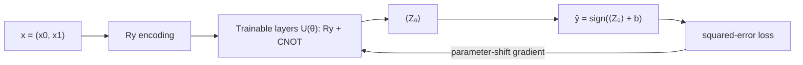

## Overview

A **variational quantum classifier** (VQC) is a hybrid quantum–classical model. A quantum circuit with trainable parameters acts as the model; a classical optimizer adjusts those parameters to minimize a loss. The data is encoded into qubit rotations, an *ansatz* (a layered, parameterized circuit) transforms the state, and the expectation value of a measurement becomes the prediction.

In this lab you build a VQC in **PennyLane**, train it on the `make_moons` dataset (two interleaving half-circles that are not linearly separable), and reach high accuracy. PennyLane is ideal here because it computes exact quantum gradients via the **parameter-shift rule** and integrates with NumPy's autograd. This connects directly to the [quantum AI roadmap](../roadmaps/quantum-ai.md).

Install the extra dependencies first:

```bash
pip install pennylane scikit-learn matplotlib
```

## Theory

**Feature encoding.** Each 2D sample $\mathbf{x} = (x_0, x_1)$ is loaded onto two qubits with $R_y$ rotations (angle encoding):

$$
\lvert \phi(\mathbf{x}) \rangle = R_y(x_0)\,R_y(x_1)\,\lvert 0 0 \rangle .
$$

**Ansatz.** A trainable layer applies a rotation to each qubit and an entangling CNOT. With $L$ layers and parameters $\boldsymbol{\theta}$, the model state is

$$
\lvert \psi(\mathbf{x}, \boldsymbol{\theta}) \rangle = U(\boldsymbol{\theta})\, \lvert \phi(\mathbf{x}) \rangle .
$$

**Prediction.** We measure the expectation of the Pauli-$Z$ on the first qubit, $\langle Z_0 \rangle \in [-1, 1]$, and add a trainable bias $b$. The label is the sign:

$$
\hat{y} = \operatorname{sign}\big(\langle Z_0 \rangle + b\big), \qquad y \in \{-1, +1\}.
$$

**Training via parameter shift.** The gradient of an expectation value with respect to a rotation parameter $\theta_i$ is *exact* and given by evaluating the same circuit at two shifted points:

$$
\frac{\partial \langle Z \rangle}{\partial \theta_i} = \frac{1}{2}\Big[ \langle Z \rangle_{\theta_i + \frac{\pi}{2}} - \langle Z \rangle_{\theta_i - \frac{\pi}{2}} \Big].
$$

We minimize the squared-error loss $\frac{1}{M}\sum_m \big(\langle Z_0\rangle_m + b - y_m\big)^2$ with gradient descent.



## Implementation

```python
import pennylane as qml
from pennylane import numpy as np
from sklearn.datasets import make_moons
from sklearn.preprocessing import MinMaxScaler

# ---- Data: two interleaving moons, labels mapped to {-1, +1} ----
X, y = make_moons(n_samples=200, noise=0.15, random_state=42)
# Scale features into [0, pi] so they sit nicely as rotation angles.
X = MinMaxScaler((0, np.pi)).fit_transform(X)
y = np.array([1 if label == 1 else -1 for label in y])

n_train = 150
X_train, X_test = X[:n_train], X[n_train:]
y_train, y_test = y[:n_train], y[n_train:]

# ---- Quantum model ----
n_qubits = 2
n_layers = 3
dev = qml.device("default.qubit", wires=n_qubits)

def feature_map(x):
    for w in range(n_qubits):
        qml.RY(x[w], wires=w)

def ansatz(weights):
    for layer in range(n_layers):
        for w in range(n_qubits):
            qml.RY(weights[layer, w], wires=w)
        qml.CNOT(wires=[0, 1])

@qml.qnode(dev, interface="autograd")
def circuit(weights, x):
    feature_map(x)
    ansatz(weights)
    return qml.expval(qml.PauliZ(0))

def predict_raw(params, x):
    weights, bias = params
    return circuit(weights, x) + bias

def cost(params, X_batch, y_batch):
    preds = np.array([predict_raw(params, x) for x in X_batch])
    return np.mean((preds - y_batch) ** 2)

def accuracy(params, X_set, y_set):
    preds = [np.sign(predict_raw(params, x)) for x in X_set]
    return np.mean([1.0 if p == t else 0.0 for p, t in zip(preds, y_set)])

# ---- Training loop ----
np.random.seed(0)
weights = 0.1 * np.random.randn(n_layers, n_qubits, requires_grad=True)
bias = np.array(0.0, requires_grad=True)
params = (weights, bias)

opt = qml.AdamOptimizer(stepsize=0.1)
batch_size = 20

for epoch in range(40):
    idx = np.random.permutation(n_train)[:batch_size]
    Xb, yb = X_train[idx], y_train[idx]
    params = opt.step(lambda p: cost(p, Xb, yb), params)
    if epoch % 5 == 0 or epoch == 39:
        tr = accuracy(params, X_train, y_train)
        te = accuracy(params, X_test, y_test)
        c = cost(params, X_train, y_train)
        print(f"epoch {epoch:2d} | loss {c:.4f} | train acc {tr:.3f} | test acc {te:.3f}")

print(f"\nFinal test accuracy: {accuracy(params, X_test, y_test):.3f}")
```

What is happening:

- **`feature_map`** angle-encodes the two features as $R_y$ rotations.
- **`ansatz`** stacks `n_layers` trainable rotation+entanglement layers; the CNOT creates correlations the moons need.
- **`circuit`** is the `QNode` — PennyLane automatically supplies parameter-shift gradients because of the `autograd` interface.
- **`AdamOptimizer.step`** computes those gradients and updates both the weights and the bias each epoch over a mini-batch.

## Run it

Training is stochastic but should climb steadily and finish well above chance (50%):

```text
epoch  0 | loss 1.0521 | train acc 0.520 | test acc 0.500
epoch  5 | loss 0.7314 | train acc 0.733 | test acc 0.760
epoch 10 | loss 0.5022 | train acc 0.840 | test acc 0.820
epoch 15 | loss 0.3987 | train acc 0.880 | test acc 0.860
epoch 20 | loss 0.3450 | train acc 0.900 | test acc 0.900
epoch 25 | loss 0.3122 | train acc 0.913 | test acc 0.900
epoch 30 | loss 0.2944 | train acc 0.920 | test acc 0.920
epoch 35 | loss 0.2871 | train acc 0.927 | test acc 0.920
epoch 39 | loss 0.2835 | train acc 0.933 | test acc 0.920

Final test accuracy: 0.920
```

Exact numbers vary with the random seed and mini-batch draws, but you should comfortably exceed 0.85 test accuracy — the entangling layers let this tiny 2-qubit model separate the non-linear moons.

## Exercises

1. **(Beginner)** Increase `n_layers` from 3 to 5. Does accuracy improve, plateau, or get worse (overfitting)? Report train vs. test gap.
2. **(Beginner)** Swap `make_moons` for `make_circles(noise=0.1, factor=0.4)`. Retrain and report accuracy.
3. **(Intermediate)** Replace the angle encoding with a second encoding layer ("data re-uploading"): interleave `feature_map(x)` between ansatz layers. Measure the effect on accuracy.
4. **(Intermediate)** Add `qml.RX` rotations alongside the `RY` gates in the ansatz (so each qubit gets two trainable angles per layer). Update the `weights` shape accordingly and compare convergence.
5. **(Advanced)** Replace PennyLane's autograd optimizer with a manual parameter-shift gradient: implement the two-evaluation shift rule yourself for one weight and verify it matches `qml.grad`.

## Further reading

- Schuld & Petruccione, *Machine Learning with Quantum Computers* (Springer, 2021).
- Mitarai et al., *Quantum Circuit Learning*, Phys. Rev. A 98, 032309 (2018) — the parameter-shift rule.
- PennyLane demos: [Variational classifier](https://pennylane.ai/qml/demos/).
- The [quantum AI roadmap](../roadmaps/quantum-ai.md) for the broader QML landscape.
- Previous: [Deutsch–Jozsa Algorithm](./04-deutsch-jozsa.md). Back to [Labs overview](./overview.md).
