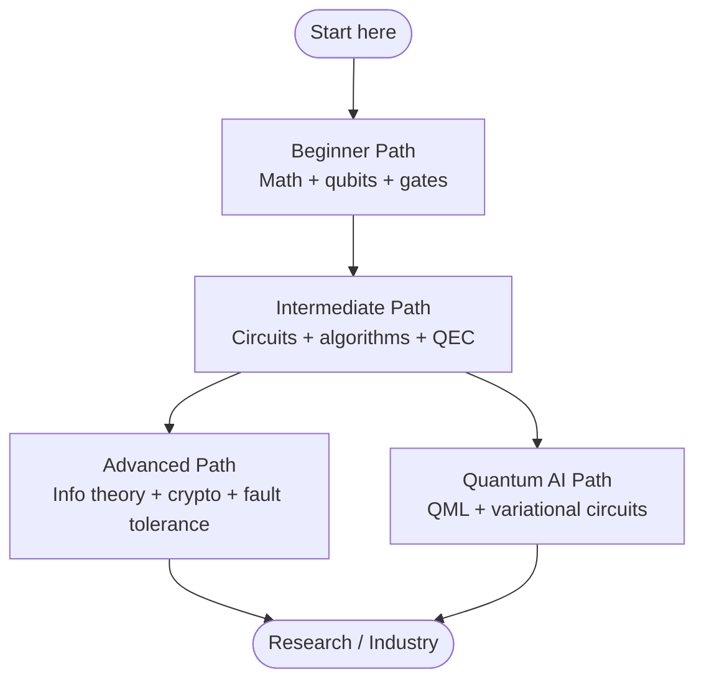

Learning quantum computing can feel like staring at a wall of unfamiliar notation, strange physics, and dense linear algebra. The goal of these roadmaps is to give you a **clear, ordered route** through that material so you always know what to study next and why it matters.

We offer four complementary paths. Three of them are sequential — **Beginner**, **Intermediate**, and **Advanced** — while the **Quantum AI** path branches off once you are comfortable with circuits and basic algorithms. You do not have to follow them rigidly, but each builds naturally on the concepts introduced in the previous one.

## How the paths fit together

The **Beginner Path** establishes the mathematical and physical vocabulary. The **Intermediate Path** turns that vocabulary into working algorithms and introduces error correction. From there you can either deepen your theoretical and engineering knowledge with the **Advanced Path**, or pivot toward machine learning applications with the **Quantum AI Path**. Many learners eventually do both.

## Choosing your path

| Path | Prerequisites | Estimated time | Outcome |
| --- | --- | --- | --- |
| [Beginner](./beginner.md) | High-school algebra; curiosity | 4–6 weeks | Understand qubits, superposition, measurement, and single/two-qubit gates; build a Bell state. |
| [Intermediate](./intermediate.md) | Beginner path or equivalent | 6–10 weeks | Design quantum circuits, implement Deutsch–Jozsa/Grover/QFT, grasp Shor and basic error correction. |
| [Advanced](./advanced.md) | Intermediate path; comfort with proofs | 10–16 weeks | Reason about quantum information theory, QKD, fault tolerance, and quantum networking. |
| [Quantum AI](./quantum-ai.md) | Intermediate path + ML basics | 6–12 weeks | Build variational circuits, encode data, and train hybrid quantum-classical models. |

## How to use these roadmaps

- **Study actively.** Each path links to [Hands-on Labs](../labs/overview.md) so you can run real code, not just read about it.
- **Pick a framework early.** Browse the [Frameworks](../frameworks/overview.md) section to choose between Qiskit, PennyLane, Cirq, and others. The examples in these roadmaps use Qiskit and PennyLane.
- **Revisit the math.** It is normal to bounce back to the Beginner Path when a new concept relies on linear algebra you have forgotten. The roadmaps are a map, not a one-way street.
- **Build something.** The fastest way to consolidate knowledge is to implement an algorithm end to end and reason about why it works.

When you are ready, jump straight into the [Beginner Path](./beginner.md).
