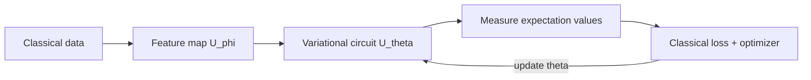

Quantum AI sits at the intersection of quantum computing and machine learning. This path branches off the [Intermediate Path](./intermediate.md) once you are comfortable with circuits and basic algorithms, and it assumes you already know classical machine learning fundamentals (loss functions, gradient descent, neural networks).

The dominant paradigm today is **variational** — short parameterized circuits trained by a classical optimizer — because it is well suited to the noisy, intermediate-scale (NISQ) hardware we currently have. We will build up to it and run a real example.

## Quantum Machine Learning

Quantum machine learning (QML) explores whether quantum computers can learn from data more efficiently, represent richer models, or process inherently quantum data. The central practical question is how to get classical data into a quantum state, since a qubit register lives in a $2^n$-dimensional Hilbert space.

**Data encoding (feature maps).** A feature map is a circuit $U_\phi(x)$ that loads a classical input $x$ into a quantum state $\lvert \phi(x) \rangle = U_\phi(x)\lvert 0 \rangle^{\otimes n}$. Common strategies:

- **Basis encoding.** Map a bitstring directly to a computational basis state. Simple but uses one qubit per bit.
- **Amplitude encoding.** Store a normalized vector of $2^n$ numbers in the amplitudes of $n$ qubits. Extremely compact, but preparing the state is generally expensive.
- **Angle encoding.** Feed each feature as a rotation angle, e.g. $R_y(x_i)$ on qubit $i$. Cheap and hardware-friendly; the standard choice for variational models.

The encoding defines an implicit **quantum kernel** — the inner product $\lvert \langle \phi(x) \vert \phi(x') \rangle \rvert^2$ measures similarity between data points, connecting QML to classical kernel methods.

## Variational Quantum Circuits

A variational (or parameterized) quantum circuit applies tunable gates $U(\boldsymbol\theta)$ and is trained by minimizing a cost function measured on its output. Two flagship algorithms define the field.

**VQE (Variational Quantum Eigensolver).** Finds the ground-state energy of a Hamiltonian $H$ by minimizing the expectation value

$$
E(\boldsymbol\theta) = \langle \psi(\boldsymbol\theta) \vert H \vert \psi(\boldsymbol\theta) \rangle,
$$

over the circuit parameters $\boldsymbol\theta$. Because $E(\boldsymbol\theta) \ge E_0$ for any trial state (the variational principle), the minimum approaches the true ground-state energy $E_0$. VQE is the workhorse of near-term quantum chemistry.

**QAOA (Quantum Approximate Optimization Algorithm).** Tackles combinatorial optimization by alternating between a problem Hamiltonian $H_C$ (encoding the cost) and a mixer Hamiltonian $H_M$:

$$
\lvert \boldsymbol\gamma, \boldsymbol\beta \rangle = \prod_{p} e^{-i\beta_p H_M}\, e^{-i\gamma_p H_C}\, \lvert + \rangle^{\otimes n}.
$$

Measuring this state yields candidate solutions, and the angles $(\boldsymbol\gamma, \boldsymbol\beta)$ are optimized classically. More layers $p$ generally give better approximations.

**Parameter-shift rule.** To train these circuits with gradient descent we need gradients of expectation values. For a gate generated by an operator with two eigenvalues (such as a Pauli rotation $R(\theta) = e^{-i\theta P/2}$), the gradient is **exact** and obtained from two circuit evaluations:

$$
\frac{\partial \langle O \rangle}{\partial \theta}
= \frac{1}{2}\left[ \langle O \rangle_{\theta + \frac{\pi}{2}} - \langle O \rangle_{\theta - \frac{\pi}{2}} \right].
$$

Unlike a finite-difference approximation, this is not an estimate of the derivative — it is the analytic value, which is why the parameter-shift rule is the standard way to compute quantum gradients on real hardware.

## Quantum Neural Networks

A **quantum neural network (QNN)** stacks layers of parameterized gates, often interleaving encoding and trainable blocks, to play the role a classical neural network does. A typical layer mixes single-qubit rotations (the trainable weights) with entangling gates (the analogue of connecting neurons).

Two practical concerns shape QNN design:

- **Expressibility vs. trainability.** Highly expressive ansätze can represent many functions but are prone to **barren plateaus** — regions where gradients vanish exponentially in the number of qubits, making training impossible. Structured, hardware-efficient, or problem-informed ansätze help avoid this.
- **Data re-uploading.** Re-encoding the input between trainable layers increases the class of functions a single qubit can represent, a uniquely quantum trick with no direct classical counterpart.

## Hybrid Quantum-Classical Models

Nearly all near-term QML is **hybrid**: a quantum circuit produces expectation values that feed into, or are wrapped by, classical computation, and a classical optimizer updates the quantum parameters.



This loop lets you offload to classical hardware whatever it does well (optimization, pre/post-processing, parts of a larger network) while reserving the quantum processor for the parts that may benefit from a large Hilbert space. The same pattern lets you embed a quantum layer inside a classical deep-learning model as just another differentiable module.

### A variational classifier in PennyLane

PennyLane integrates quantum circuits with automatic differentiation, so the parameter-shift gradients above are handled for you:

```python
import pennylane as qml
from pennylane import numpy as np

n_qubits = 2
dev = qml.device("default.qubit", wires=n_qubits)

@qml.qnode(dev)
def circuit(x, weights):
    # Angle-encode the input features
    for i in range(n_qubits):
        qml.RY(x[i], wires=i)
    # Trainable variational layer
    for i in range(n_qubits):
        qml.RY(weights[i], wires=i)
    qml.CNOT(wires=[0, 1])
    # Output: expectation of Z on qubit 0
    return qml.expval(qml.PauliZ(0))

def cost(weights, X, Y):
    preds = np.array([circuit(x, weights) for x in X])
    return np.mean((preds - Y) ** 2)

# Toy data and training loop
X = np.array([[0.1, 0.2], [1.5, 1.4]], requires_grad=False)
Y = np.array([1.0, -1.0], requires_grad=False)
weights = np.array([0.01, 0.01], requires_grad=True)

opt = qml.GradientDescentOptimizer(stepsize=0.3)
for step in range(50):
    weights = opt.step(lambda w: cost(w, X, Y), weights)

print("Trained weights:", weights)
```

PennyLane computes gradients via the parameter-shift rule under the hood, so this small classifier trains exactly the way a classical model would — by following the gradient downhill.

## What's next

Put this into practice in the [QML classifier lab](../labs/05-qml-classifier.md), and dig into the framework that powers the example above on the [PennyLane](../frameworks/pennylane.md) page. If you want to revisit the variational algorithms' algorithmic roots, the [Intermediate Path](./intermediate.md) covers the circuits and simulation techniques they build on, while the [Advanced Path](./advanced.md) gives the information-theoretic context.
